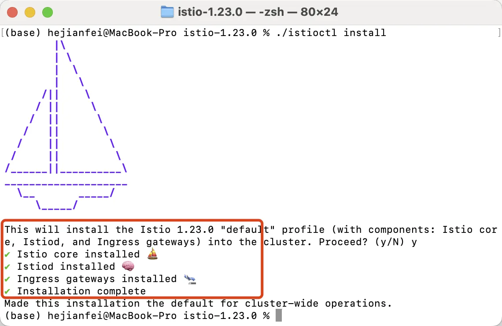
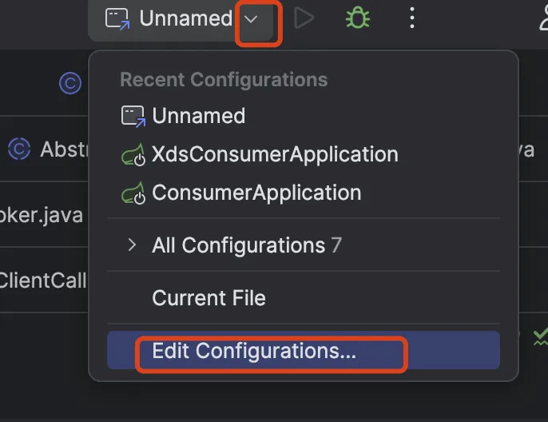
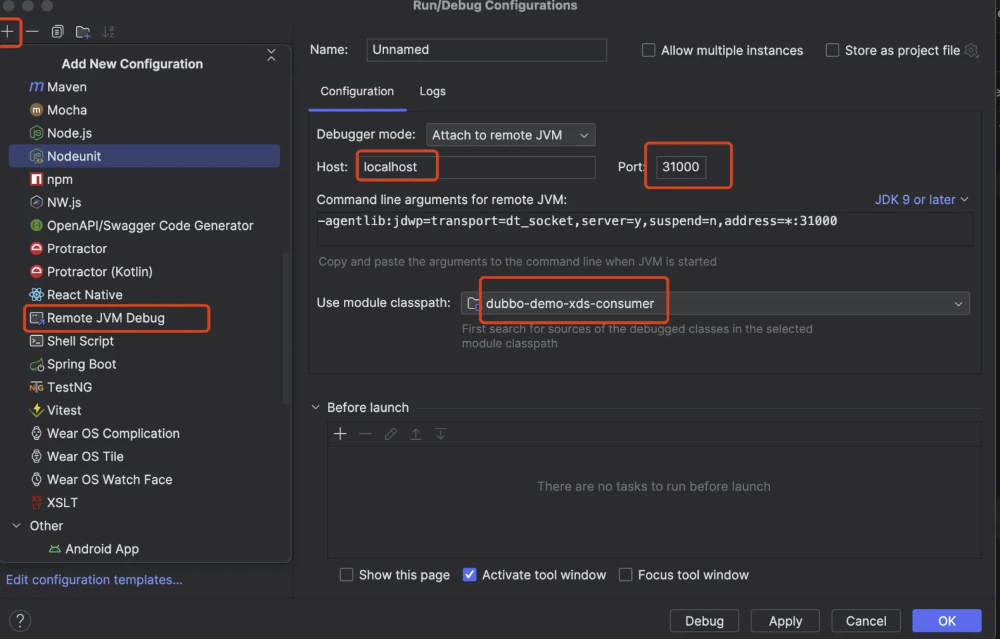
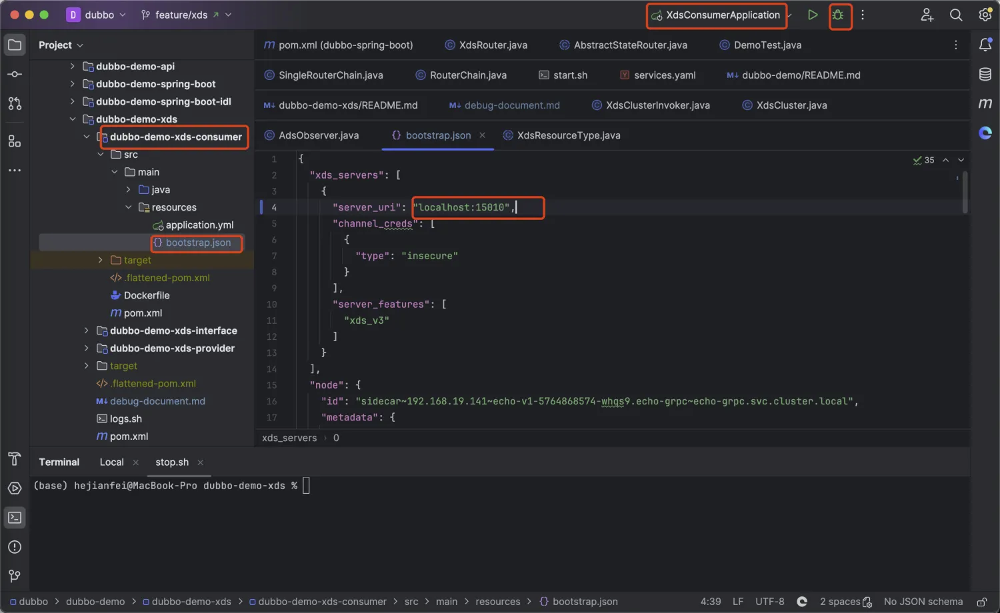

# 01 环境配置
## 1.1 安装Docker Desktop
前往 **Docker** 官网下载安装。[https://www.docker.com/products/docker-desktop/](https://www.docker.com/products/docker-desktop/)


安装完成后，在 **Docker Desktop**中点击 **设置**-> **kubernetes**-> **Enable kubernetes**开启k8s集群。

> 注意： Mac 开启 k8s 集群时可能会存在拉取镜像问题，解决方法可参考 [https://blog.csdn.net/qq_43705697/article/details/143894239](https://blog.csdn.net/qq_43705697/article/details/143894239)
>

## 1.2 安装istio
下载对应的 istioctl 安装包 [https://github.com/istio/istio/releases](https://github.com/istio/istio/releases)

进入到下载包所在路径，执行命令`istioctl install`进行安装。



> 注意：若 Mac电脑 安装过程中提示无法校验安全性，此时先不要关闭弹出窗口，只需要打开 「设置」-「隐私与安全性」-「仍要运行」，随后再执行一次`istioctl install` 命令，就会看到一个弹窗，点击打开，即可安装。

# 02 远程K8s调试示例
## 2.1 开启镜像仓库
部署示例时会在本地打包并推送镜像，所以需要先在本地启动一个镜像仓库。

执行如下命令后，会自动在本地启动一个镜像仓库容器用于存放镜像。

```shell
docker run -d -p 5000:5000 --restart=always --name local-registry registry:2
```

## 2.2 拉取&编译代码
**1、执行命令拉取Dubbo的`feature/xds`分支**

```shell
git clone -b feature/xds https://github.com/apache/dubbo.git
```

**2、代码格式化**

```shell
mvn spotless:apply
```

**3、编译代码时跳过测试**

```shell
mvn clean install -DskipTests
```

## 2.3 运行示例
在`dubbo/dubbo-demo/dubbo-demo-xds`目录下执行`./start.sh`命令即可运行示例。

`start.sh`脚本主要完成的任务如下：

1、新建名为`dubbo-demo`的`namespace`，并切换到此`namespace`。

2、构建`dubbo-demo-xds-provider`和`dubbo-demo-xds-consumer`镜像，并推送至刚刚开启的本地镜像仓库。构建镜像时将`resource/bootstrap.json`文件拷贝至镜像 `/bootstrap.json`目录下，同时开启远程`debug`端口。

3、通过`service.yaml`文件，创建`k8s`资源。

4、端口转发，将`istiod`的`15010`端口进行转发，方便本地直连`istiod`。将`dubbo-demo-xds-consumer`服务的`31000`端口进行转发，方便远程`debug`。

## 2.4 IDEA开启远程debug
运行`start.sh`脚本后，通过`Docker Desktop`查看对应`pod`日志，可以看到`dubbo-demo-xds-provider`服务会自动运行，而`dubbo-demo-xds-consumer`服务暂时挂起，等待调试中。此时需要编辑本地`idea调试配置`，增加断点，即可开始调试。

**1、编辑调试配置**



**2、新增`Remote JVM Debug`类型的配置，端口设置为`31000`，`module`选择`dubbo-demo-xds-consumer`。**



**3、新增断点后，点击调试按钮，即可进行远程调试。**

---

**特别说明**

1、`dubbo-demo-xds-consumer`服务挂起的原因是因为通过`service.yaml`文件部署资源时设置了`suspen=y`，如果仅仅是运行示例，不需要调试，可以修改为`suspend=n`，编译代码后，重新执行`start.sh`进行部署，此时会看到两个服务都会启动。


2、对于开发人员，每次修改`dubbo-xds`模块代码后，都需要重新执行`mvn spotless:apply`代码格式化，然后执行`mvn clean install -DskipTests`编译打包，最后执行`./start.sh`构建镜像，重新部署容器。

# 03 本地调试
上面的示例我们将`provider`和`consumer`服务都部署在了`K8s`中进行远程调试，但是这样有个缺点：一旦更改了`dubbo-xds`模块中的代码，都需要重新编译打包整个项目，耗时较长。

所以现在介绍一种效率更高的开发方法，修改代码后直接点击调试即可，不需要重新编译打包部署。

但这种方式只能用于调试资源加载过程，实际调用`k8s`中的`provider`会因为网络访问不到而失败。

原理：仍然在`k8s`中部署`provider`服务，但是`consumer`服务在本地`IDEA`中进行启动，同时转发`istiod`服务的`15010`端口，确保可以从`istiod`中获取`xds`资源。

整体步骤如下：

1、还是运行`./start.sh`将`provider`服务部署到`k8s`环境中，并且转发了`istiod`服务的`15010`端口。

2、修改本地`dubbo-demo-xds-consumer/src/resource/bootstrap.json` 文件，修改`server_uri为localhost:15010`。

3、在 `XdsConsumerApplication` 启动类`main()`函数中设置环境变量指明`bootstrap.json`所在路径， `System.setProperty("GRPC_XDS_BOOTSTRAP", "修改为自己的路径")`

4、点击调试即可进行本地调试。


